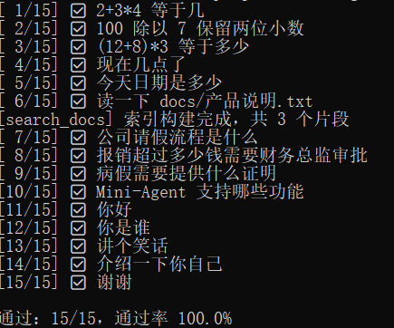

# Mini-Agent

一个本地 AI Agent，支持工具调用、RAG 知识库检索、Web 界面、可观测性。

## 核心能力

- **多轮对话**：流式输出 + 上下文记忆
- **Function Calling**：模型自主决定调用哪个工具
- **4 个内置工具**：计算器、时间查询、文件读取、文档检索
- **RAG 知识库**：基于 docs/ 目录的语义检索，回答带引用
- **工具注册机制**：加新工具只需改一个文件
- **工具重试 + 客户端限速**：应对不稳定 API 和 RPM 限制
- **可观测性**：手写 Trace + Langfuse 双通道
- **评估集**：15 条用例量化 Agent 效果
- **部署**：Docker Compose 一键启动

## 架构

```
浏览器 → Streamlit → FastAPI → Agent循环 → LLM
                                    ↓
                              工具注册中心
                                    ↓
            calculator / get_time / read_file / search_docs
                                    ↓
                    RAG（loader → splitter → embedder → retriever）
```

## 快速开始

### 方式一：Docker（推荐）

```bash
git clone <your-repo-url>
cd mini-agent
cp .env.example .env    # 填入你的 API Key
docker compose up --build
```

访问：
- 前端：http://localhost:8501
- 后端文档：http://localhost:8000/docs

### 方式二：本地 Python

```bash
python -m venv .venv
.venv\Scripts\Activate.ps1     # Windows
pip install -r requirements.txt

# 终端1
uvicorn app.server:app --reload --port 8000

# 终端2
streamlit run web/streamlit_app.py
```

## 环境变量

复制 `.env.example` 为 `.env`，填入：

```
# 聊天模型（DeepSeek / Kimi / OpenAI）
OPENAI_API_KEY=sk-xxx
OPENAI_BASE_URL=https://api.moonshot.cn/v1
MODEL=kimi-k2.6

# 向量模型（硅基流动）
EMBEDDING_API_KEY=sk-xxx
EMBEDDING_BASE_URL=https://api.siliconflow.cn/v1
EMBEDDING_MODEL=BAAI/bge-m3

# 限速（Kimi RPM=3 时填 3，不限则填 0）
LLM_RPM=3

# 可观测性（可选）
LANGFUSE_PUBLIC_KEY=pk-lf-xxx
LANGFUSE_SECRET_KEY=sk-lf-xxx
LANGFUSE_HOST=https://cloud.langfuse.com
```

## 评估

```bash
python eval/run_eval.py
```

输出示例：

[ 1/15] ✅ 2+3*4 等于几
[ 2/15] ✅ 100 除以 7 保留两位小数
...
通过：15/15，通过率 100.0%

## 评估结果



## 项目结构

```
app/
  llm.py             # LLM客户端（含限速）
  agent.py           # Agent循环
  messages.py        # 消息构建
  trace.py           # 手写调用日志
  observability.py   # Langfuse集成
  server.py          # FastAPI后端
  chat.py            # 命令行界面
  config.py          # 配置
  tools/             # 工具（注册即用）
    registry.py      # 注册中心
    calculator.py
    time_tool.py
    file_reader.py
    search_docs.py
  rag/               # RAG检索
    loader.py
    splitter.py
    embedder.py
    retriever.py
    index.py
web/
  streamlit_app.py   # 网页前端
eval/
  cases.jsonl        # 评估用例
  run_eval.py        # 评测脚本
docs/                # 知识库文档
Dockerfile
docker-compose.yml
```

## 技术栈

- Python 3.11
- OpenAI SDK（兼容 DeepSeek / Kimi / 硅基流动）
- FastAPI + Uvicorn
- Streamlit
- Docker + Docker Compose
- Langfuse
- pytest